# QUAI ANTIQUE

Site /Application Web vitrine, pour un restaurant gastronomique le Quai Antique, situé en Savoie à Annecy, sous la direction du chef Arnaud Michant. 

Cette plateforme permet aux visiteurs d'accéder à toutes les informations relatives au restaurant et aux clients, inscrits, de réserver une table. La direction du Restaurant (hôte d'accueil et son équipe) peut gérer toutes les réservations, inscrire un client, modifier les horaires du restaurant, modifier la carte et ses menus.

Suivant la volonté du Quai Antique, les places disponibles sont affichées lors de la réservation par date et heure, les allergies alimentaires des clients inscrits, sont remplis automatiquement lors de chaque réservation, le personnel du Quai Antique peut modifier la galerie d'images sur la page d'accueil et les horaires sont affichés, sur chaque pied de page, lors de la navigation.

Site réalisé avec les versions:
- HTML 5
- CSS 3
- BOOSTRAP 5.2
- PHP 8.1
- SQL 10.4.27-MariaDB
- SYMFONY 6.2
- JAVASCRIPT

Serveur: gandi

Lien de l'application web en ligne: 
https://quai-antique.christine-chau-projets.com/

Lien du dépôt github:
https://github.com/christinemiko/quai_antique

Lien TRELLO ,logiciel pour la gestion de ce Projet:
https://trello.com/b/hmVhvsGL/projet-ecf-quai-antique-christine-chau

Les fichiers de création de la base de données sont dans:
quai_antique\migrations

Les fichiers d'alimentation de la base de données sont dans:
quai_antique\src\DataFixtures

La documentation technique ( Diagramme de Classe, Diagramme de séquence, Diagramme de cas d'utilisation, charte graphique) 
se trouve dans le dossier: "Schéma MCD, Diagramme de Cas utilisation, de Séquence, Charte Graphique"

La documentation maquettes ( Mockup Desktop et Mockup Mobile) 
se trouve dans le dossier: "Maquette Mockups Mobile & Desktop".

Le manuel d'utilisation se trouve dans quai_antique/manuel dutilisation quai antique.pdf


## Auteur

- [@christinemiko](https://github.com/christinemiko)


## Déploiement en Local

Pré-requis:  L'installation des logiciels suivants est nécessaire pour le déploiement en local, avant de commencer toutes les étapes.
- Xampp (inclus Apache et MySQL)
- Github
- phpMyAdmin
- PHP 8.1
- Symfony 6.2
- Php Storm


1. Etape 
- Aller sur le lien Github du projet https://github.com/christinemiko/quai_antique
- Cliquez sur le bouton vert " <> Code "
- Copiez le lien HTTPS du projet https://github.com/christinemiko/quai_antique.git
  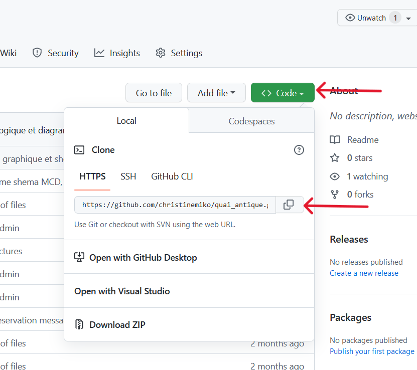

2. Etape 
 - Aller dans Windows(C:) > symfony 
 - Clic Droit sur la souris à cet emplacement (dans le vide) > afficher plus d'options > Cliquez sur Gitbash Here
 - Un terminal s'affiche, taper le ligne de commande ci-dessous, pour cloner le projet en local, dans l'espace.
```bash
  git clone https://github.com/christinemiko/quai_antique.git

```
 Le projet est enregistré en Local. Un Dossier Quai Antique est  nouvellement présent et visible  
 dans Windows(C:) > symfony > quai_antique .

3. Etape
- Ouvrir ce dossier quai_antique dans PhpStorm.
- Aller dans votre terminal sous phpStorm 
- dans le terminal de PhpStorm entrez le code:
```bash 
 Symfony serve

```
- lorsque symfony est bien connecté,
le message suivant s'affiche dans le terminal :
```bash 
 [OK] Web serverlistening                                                                                              
      The Web server is using PHP CGI 8.1.12                                                                            
      http://127.0.0.1:8000                   

```
4. Etape
- Cliquez sur   http://127.0.0.1:8000  dans le terminal de PhpStorm.
  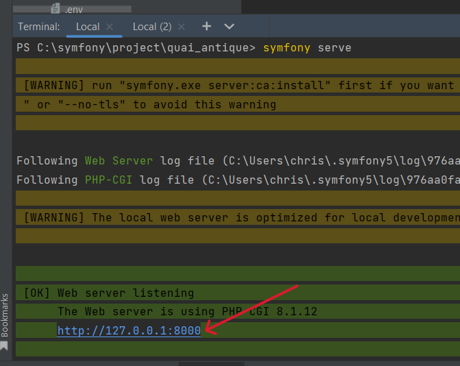

- La page d'accueil du QUAI ANTIQUE est affichée en localHost 127.0.0.1.8000 
 Pour les Admins et les clients , le portail de connexion est le même. Il suffit de rentrer ses identifiants pour avoir accès, en fonction du rôle de l'utilisateur aux différentes interfaces du site.
  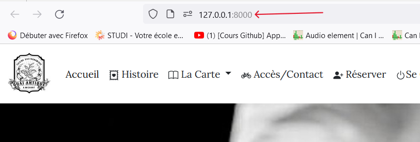
 5. Création d'un ADMIN
 - Un admin ne peut être créer que par un autre Admin.
   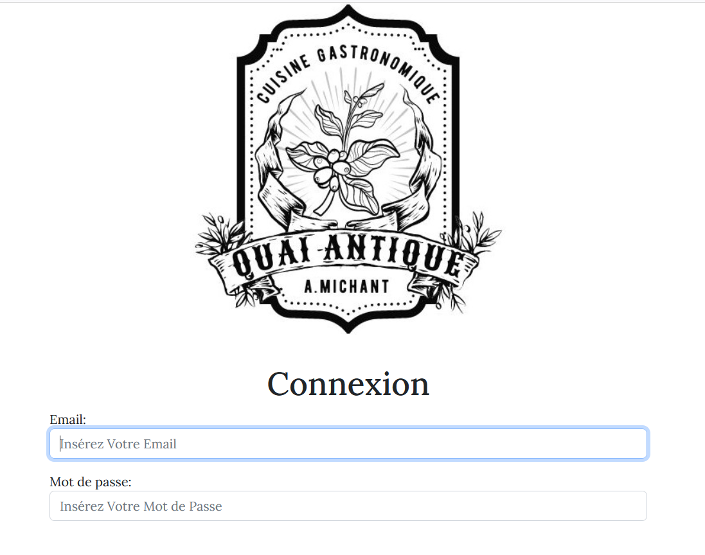
 - Après la connexion sur le portail par un Admin, sur la page d'accueil, Cliquez sur l'icône les administrateurs.
   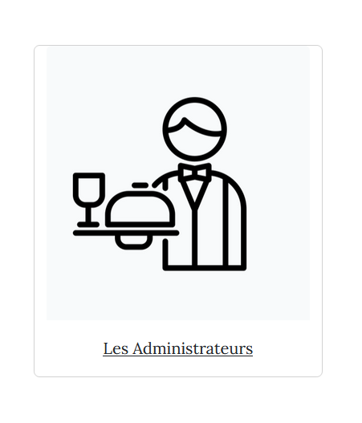
 - Dans cet espace "administrateurs", Cliquez sur "Créer un administrateur" .
   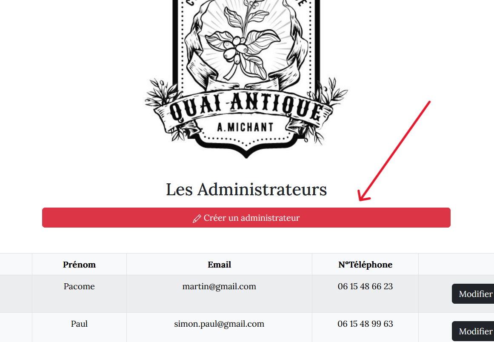
 - Un formulaire apparaît, remplissez les données pour cet nouvel admin puis cliquez sur "envoyer".
   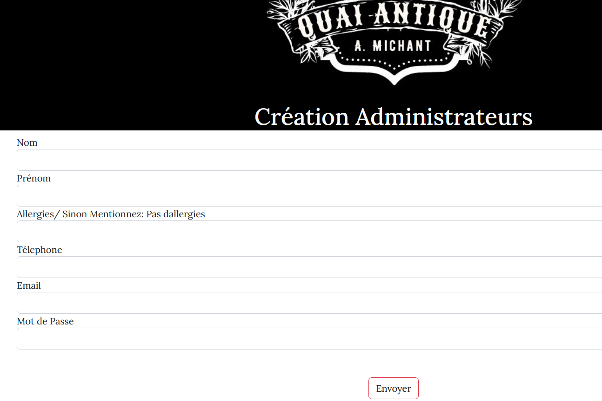
 - Le nouvel admin est enregistré et ses données sont visibles sur l'espace "les administrateurs".
 - Ce nouvel Admin peut dès à présent, se connecter avec ses propres identifiants sur le portail de connexion et a accès à tous les droits d'administrateurs sur le site.

## Deploiement en Ligne avec Gandi.net


Pré-requis:  L'installation des logiciels suivants est nécessaire pour le déploiement en ligne, avant de commencer toutes les étapes.
- Xampp (inclus Apache et MySQL)
- phpMyAdmin
- PuTTY sur https://www.putty.org/
- Inscription sur Gandi.net
- déploiement avec Github

1. Etape 

- Inscription sur gandi.net 
- Sélectionnez dans Produits > hébergement Web > advanced
- Confirmez la souscription du pack
- Dans **NOM DE DOMAINE** Définir le nom de domaine du projet
- Dans **HEBERGEMENT WEB/ Vue générale** Définir les langages PHP 8.1 et SQL 8.0
- Dans **HEBERGEMENT WEB /Vue générale** Définir le protocole sFTP
- Dans **HEBERGEMENT WEB /administration et sécurité** Définir les informations de connexion pour le mot de passe.

2. Etape
- Dans **HEBERGEMENT WEB /Hosting-2031554/Sites** Cliquez sur "Créer un site"
quai-antique. Le nom du site vient d'être crée avec son URL http://quai-antique.com
  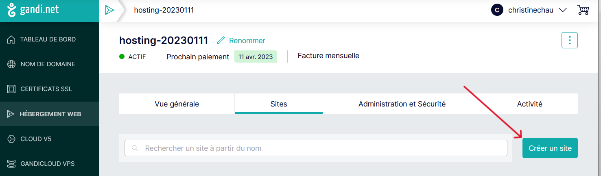
-Dans **HEBERGEMENT WEB /Hosting-2031554/administration et sécurité** Cliquez sur "Console d'urgence" pour activer le terminal de gandi.
  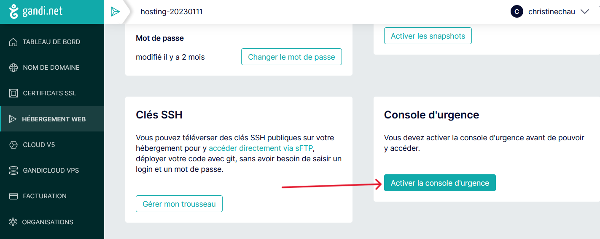
- Lorsque la console d'urgence est activité, ce message apparait "CONSOLE d'URGENCE Activé".
- Ouvrir puTTY, cliquez sur Gandi puis sur "Open". Un terminal s'ouvre.
  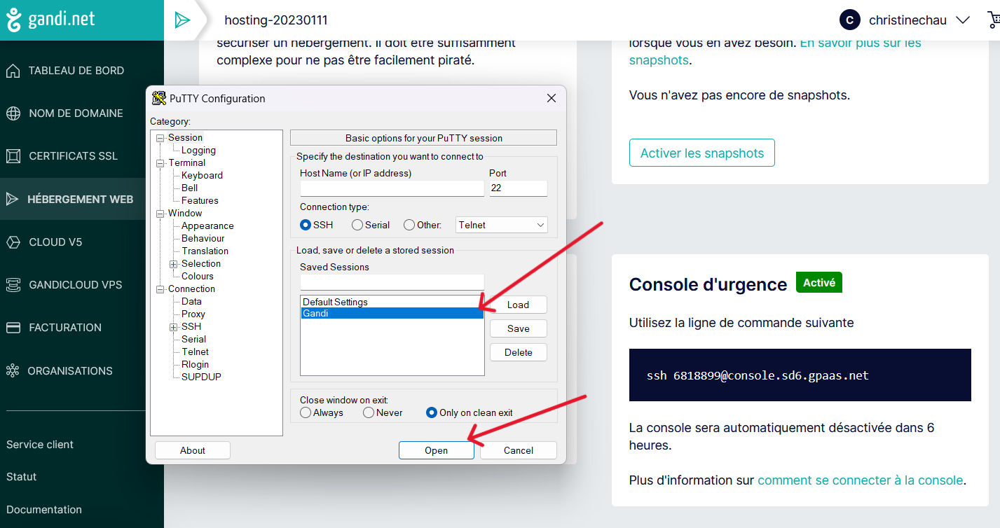
- Entrez le mot de passe gandi, puis cloner le projet github dans ce terminal.
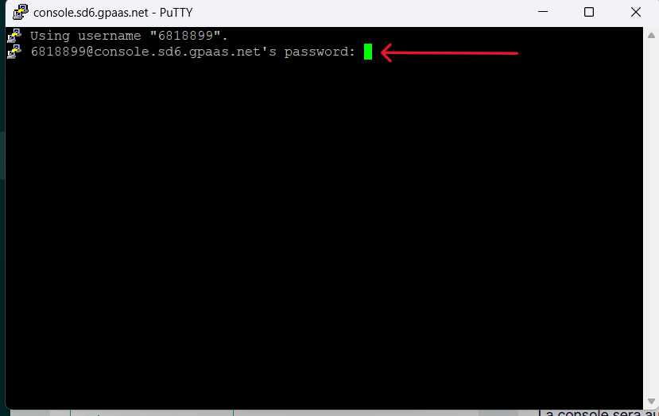
Attention!!!! il faut insérer la clé token avec un @ transmise par gandi,entre // et le mot github. Exemple ci dessous.
  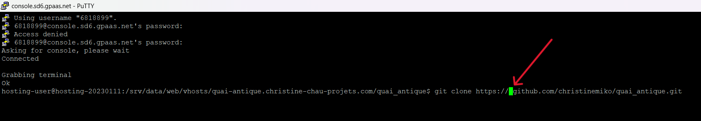
```bash
git clone https://clé-token@github.com/christinemiko/quai_antique.git
```
Le projet est cloné sur gandi.

3. Etape
- Dans **HEBERGEMENT WEB /administration et sécurité** allez sur Base données pour charger la bdd MySQL.
- Cliquez sur le bouton vert " Allez sur phpMyAdmin".
-   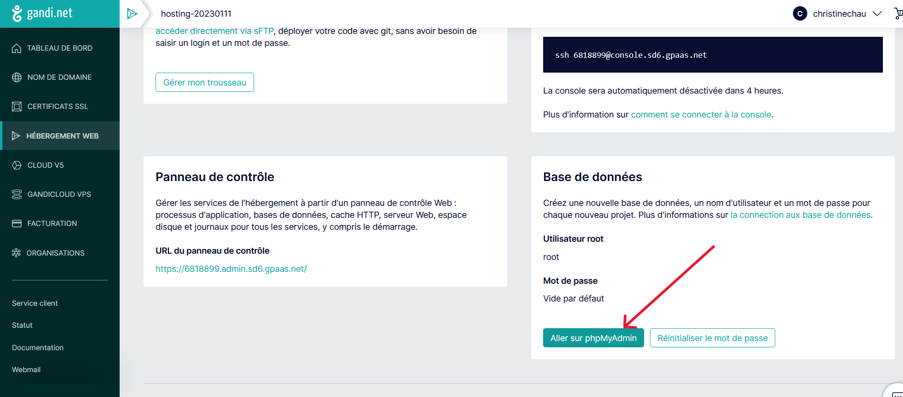
Cela ouvre une fenêtre avec phpMyAdmin.
- Créer une nouvelle base de données avec le nom ci-dessous

```bash
  quai_antique
```
Une nouvelle base de données , nommée quai_antique apparait dans phpMyAdmin, dans le menu a gauche.
- Cliquez sur quai_antique puis sur Importer dans le menu en haut.
- Sélectionnez le fichier (.sql) avec parcourir puis finalisez en cliquant sur **importer** tout en bas de la page.
  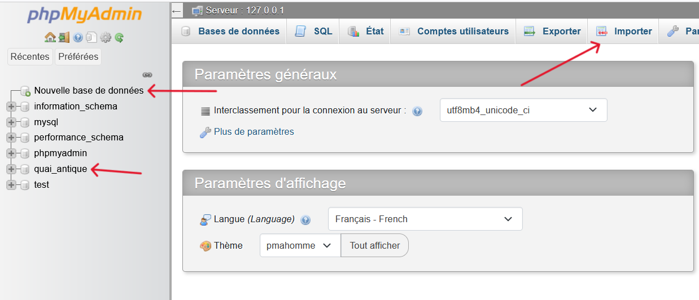
La base de données originel a été exporter sur le phpMyAdmin de gandi.

4. Etape
- Pour configurer l'url en HTTPS, 
Dans **HEBERGEMENT WEB /Hosting-2031554/Sites / quai-antique/Sécurisez votre site en définissant une stratégie SSL** Cliquez sur Votre stratégie SSL actuelle est HTTP only. 
- Cliquez sur "Changer". Cliquez sur HTTPS Only. Lurl est maintenant uniquement en HTTPS.
  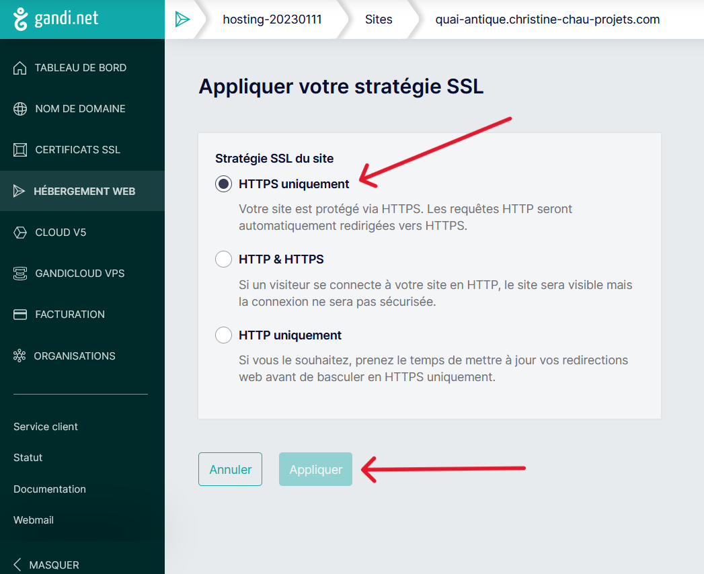
5. Etape
- Retournez sur gandi.net dans **HEBERGEMENT WEB / Sites**
- Dans **Statut**: 
- **En attente** est affiché si les données sont en cours de chargement.
 Il est nécessaire d'attendre 15 minutes pour le déploiement en ligne , après le chargement.
- **actif** est affiché si le site est en ligne.
- Cliquez sur le nom du projet lorsque celui -ci est **actif**.
 Un message de confirmation de mise en ligne apparait avec l'URL exact du site internet.
 
- Cliquez sur cette URL , la page d'accueil du Quai Antique est affichée. Il suffit de rentrer ses identifiants pour accéder au site.
 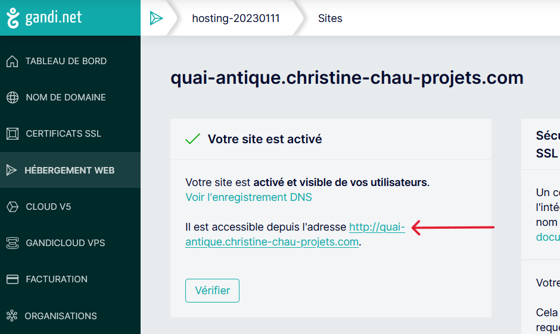
